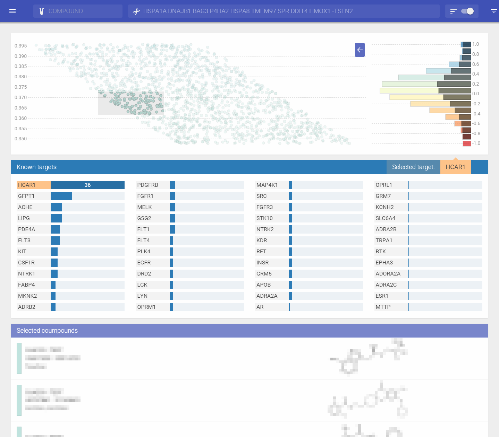

# Version 1

This is the old version of the ComPass interface, developed by [Herkulano](https://herkulano.com/).



# ComPass Frontend

### Instructions

Install [Node.js](https://nodejs.org/) first

Afterwards install [Yeoman](http://yeoman.io/) and the [Polymer Generator](https://github.com/yeoman/generator-polymer)

```
npm install -g yo
```

```
npm install -g generator-polymer
```

Install bower:

```
npm install -g bower
```

Install gulp:

```
npm install -g gulp
```

Run NPM and Bower in the project's directory to install the dependencies

```
npm install
```

```
bower install
```

Live reload with [Gulp](http://gulpjs.com/)

```
gulp serve
```

Build and [Vulcanize](https://www.polymer-project.org/0.5/articles/concatenating-web-components.html) the project with [Gulp](http://gulpjs.com/). Puts files in the ```/dist``` folder 
```
gulp
```

### Frameworks and libraries used

[Polymer](https://www.polymer-project.org/0.5/) - Web Components  
[D3](https://github.com/mbostock/d3) - Data Visualization  
[Director](https://github.com/flatiron/director) - Routing


