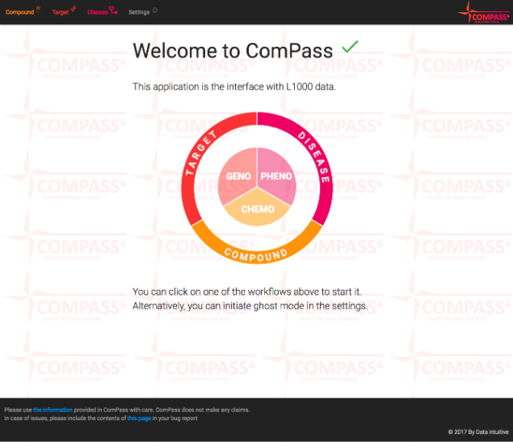
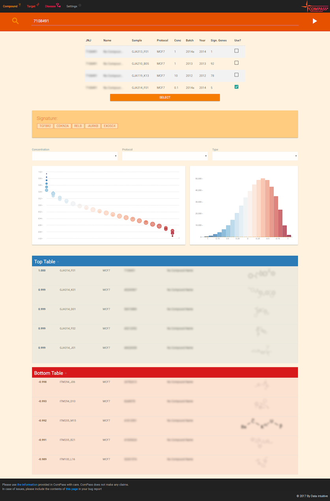
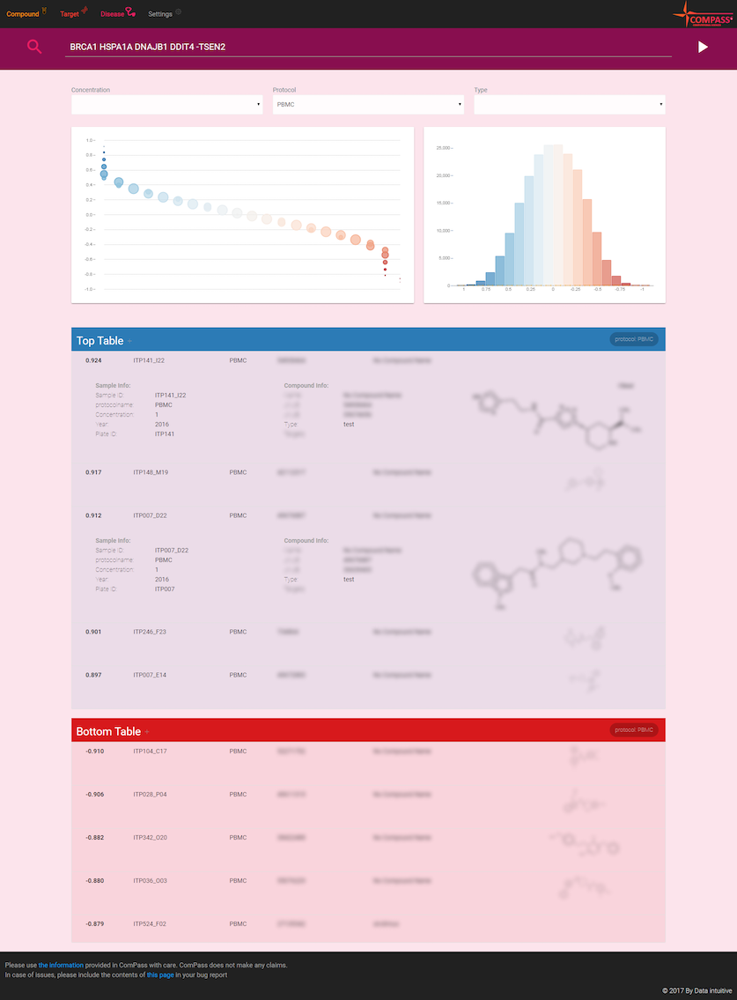
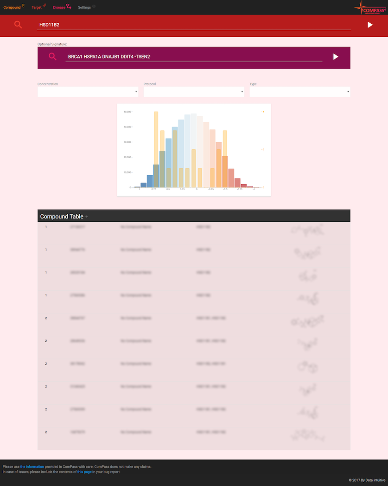
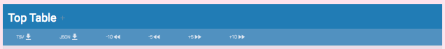
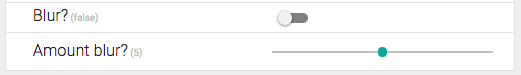
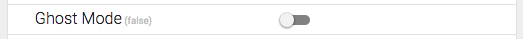

# Introduction

[LuciusWeb](https://github.com/data-intuitive/LuciusWeb) is the web component of an [L1000 data](http://genometry.com/) querying application where the data processing itself is done using Spark.

It is currently deployed in beta at [Janssen](http://www.janssen.com/belgium/) under the name ComPass.

The app uses [cycle.js](https://cycle.js.org/) as a reactive Javascript library. The following packages are instrumental:

- [Vega](https://vega.github.io/vega/) for the visualization components.
- [cycle-onionifiy](https://github.com/staltz/cycle-onionify) for state management
- [cycle-storagify](https://github.com/staltz/cycle-storageify) for storing settings
- [Materialize-CSS](http://materializecss.com/) for styling and layout


# Screenshots

The home screen shows an interactive SVG with the 3 workflows the user can start.



## Compound Workflow



## Disease Workflow



## Target Workflow




# Use

The [LuciusAPI](https://github.com/data-intuitive/LuciusAPI) REST backend is required for running this webapp.

Getting the necessary dependencies:

```
npm install
```

Starting the app in development mode:

```
npm run serve
```

# Remarks

## Interactive Tables

The UI for the tables has has been kept as clean as possible. There is a drawer for every table that appears when clicking the table header:



In order of appearance, this allows one to:

- Export the data in the table to tab-separated format (to be imported in Excel or …)
- Export the data in JSON format
- Subtract 10 rows
- Subtract 5 rows
- Add 5 rows
- Add 10 rows

Clicking the option drawer again closes it.

## Blurring

In settings, there is now an on/off switch to enable blurring of sensitive data.



The amount of blur can be tuned as well, although I expect the default of 5 to be fine.

## Ghost mode

In settings, there is one option that requires mentioning: Ghost mode.



Switch it on and switch to a workflow. A pre-defined scenario will run for all 3 workflows with popup comments explaining the steps performed.
